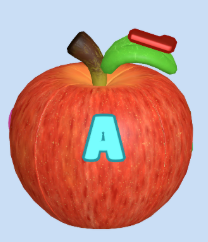
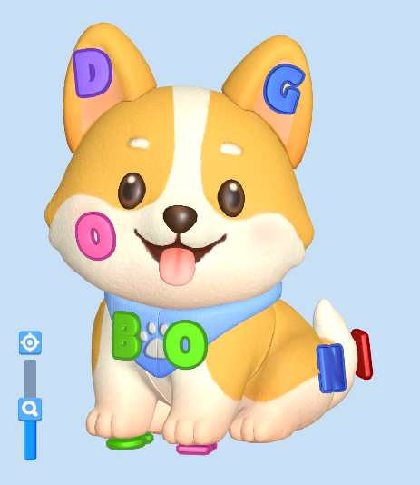
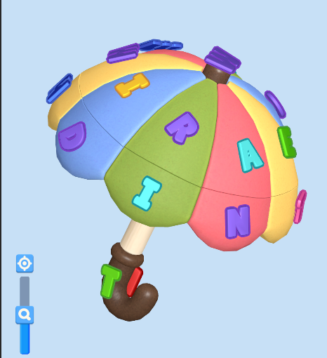
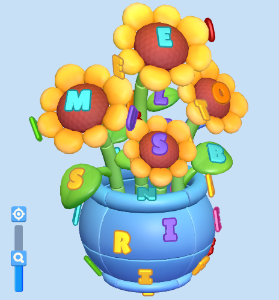
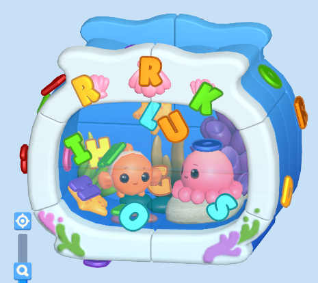

```{r setup, include = FALSE}
library(tidyverse)
library(kableExtra)
library(plotly)
library(htmltools)
load("../data1509")

f10lv21 <- d_level_full |> filter(event_date <= as.Date("2026-07-28") + 15 & version == "2.1" & level <= 10) |> summarise(.by = level, across(where(is.numeric), sum))
f10lv23 <- d_level_full |> filter(event_date <= as.Date("2026-08-26") + 15 & version == "2.3" & level <= 10) |> summarise(.by = level, across(where(is.numeric), sum))

drop_flow21 <- d_level_drop_last_activities |> filter(version == 2.1 & level <= 10) |> summarise(.by = c(level, event_sequence), across(where(is.numeric), sum))

drop_flow23 <- d_level_drop_last_activities |> filter(version == 2.3 & level <= 10) |> summarise(.by = c(level, event_sequence), across(where(is.numeric), sum))

drop_flow21$version = "2.1"
drop_flow23$version = "2.3"
f10lv21$version = "2.1"
f10lv23$version = "2.3"
```

<details>
<summary><span style="font-size:2em;font-weight:bold;">1. Performance của bản 2.3 so với 2.1</span></summary>

> Số liệu của 15 ngày đầu tiên sau khi rollout của mỗi bản

```{r}
rr15d.21 <- d_cohort_retention |> filter(between(event_date, as.Date("2026-07-28"), as.Date("2026-07-28") + 15) & version == "2.1")
rr15d.23 <- d_cohort_retention |> filter(between(event_date, as.Date("2026-08-26"), as.Date("2026-08-26") + 15) & version == "2.3")

rr15d.21.sum <- rr15d.21 |> summarise(.by = event_date, across(starts_with("d"), sum)) |> mutate(dx = as.numeric(event_date - as.Date("2026-07-28")), rrd1 = d1_users * 100 / d0_users, rrd7 = d7_users * 100 / d0_users) |> arrange(dx)
rr15d.23.sum <- rr15d.23 |> summarise(.by = event_date, across(starts_with("d"), sum)) |> mutate(dx = as.numeric(event_date - as.Date("2026-08-26")), rrd1 = d1_users * 100 / d0_users, rrd7 = d7_users * 100 / d0_users) |> arrange(dx)

rr15d.21.sum$version = "2.1"
rr15d.23.sum$version = "2.3"
df <- rbind(rr15d.21.sum, rr15d.23.sum) %>%
  pivot_longer(cols = c(rrd1, rrd7), names_to = "metric", values_to = "value")

ggplotly((ggplot(df, aes(x = dx, y = value, color = version, linetype = metric)) +
  geom_line(linewidth = 1)) + scale_x_continuous(breaks = seq(0, 15,1 )) + labs(title = "Retention D1 & D7"))

htmltools::HTML("<br><br>")

ds15d.21 <- d_daily_stats |> filter(between(event_date, as.Date("2026-07-28"), as.Date("2026-07-28") + 15) & version == "2.1")
ds15d.23 <- d_daily_stats |> filter(between(event_date, as.Date("2026-08-26"), as.Date("2026-08-26") + 15) & version == "2.3")

ds15d.21.sum <- summarise(ds15d.21, .by = event_date, across(where(is.numeric), sum)) |> mutate(dx = as.numeric(event_date - as.Date("2026-07-28")))
ds15d.23.sum <- summarise(ds15d.23, .by = event_date, across(where(is.numeric), sum)) |> mutate(dx = as.numeric(event_date - as.Date("2026-08-26")))

ds15d.21.sum$version = "2.1"
ds15d.23.sum$version = "2.3"

df <- rbind(ds15d.21.sum, ds15d.23.sum) %>%
  pivot_longer(cols = dau, names_to = "metric", values_to = "value")

ggplotly((ggplot(df, aes(x = dx, y = value, color = version, linetype = metric)) +
  geom_line(linewidth = 1)) + scale_x_continuous(breaks = seq(0, 15,1 )) + labs(title = "DAU"))

htmltools::HTML("<br><br>")

ggplotly(rbind(ds15d.21.sum, ds15d.23.sum) |> pivot_longer(c(ad_rev, iap_rev), names_to = "rev_type", values_to = "rev") %>%
  ggplot(aes(x = dx, y = rev, fill = rev_type)) +
  geom_col() + facet_wrap(~version) + scale_x_continuous(breaks = seq(0, 15,1 )) + labs(title = "Ads & IAP Rev"))
```

<details style="background-color:#f5f5f5">
<summary><i>IAA rev của 10 lv đầu</i></summary>

```{r}


ggplotly(ggplot(rbind(f10lv21, f10lv23), aes(x = level, y = ad_revenue, fill = version)) + geom_col(position = "dodge") + scale_x_continuous(breaks = seq(0, 10, 1))) |> plotly::layout(paper_bgcolor='#f5f5f5', plot_bgcolor='#f5f5f5')

ggplotly(ggplot(rbind(f10lv21, f10lv23), aes(x = level, y = start_users, fill = version)) + geom_col(position = "dodge") + scale_x_continuous(breaks = seq(0, 10, 1))) |> plotly::layout(paper_bgcolor='#f5f5f5', plot_bgcolor='#f5f5f5')
```
</details>

<br><br>

```{r}
df2 <- rbind(ds15d.21.sum, ds15d.23.sum) |>
  mutate(
    avg_num_sessions = total_sessions / dau,
    avg_playtime_per_dau = engagement_time_msec / dau / 60000,
    avg_session_length = engagement_time_msec / total_sessions / 60000
  )

scale_factor <- max(df2$avg_playtime_per_dau) / max(df2$avg_num_sessions)

p <- df2 |>
  pivot_longer(c(avg_playtime_per_dau, avg_session_length), names_to = "metric", values_to = "time_val") |>
  ggplot() +
  geom_col(aes(x = dx, y = avg_num_sessions, fill = version),position = "dodge") +
  geom_line(aes(x = dx, y = time_val / scale_factor, color = version, linetype = metric), linewidth = 0.8) + scale_color_manual(values = c("2.1" = "darkred", "2.3" = "darkgreen")) +
  scale_y_continuous(
    name = "Avg Sessions",
    sec.axis = sec_axis(~ . * scale_factor, name = "Time (min)")
  ) + labs(title = "Playtime & Sessions")

ggplotly(p)
```

### Kết luận

- Bản 2.3 có performance không khá hơn bản 2.1, có phần còn tệ hơn.

</details>

<details>
<summary><span style="font-size:2em;font-weight:bold;">2. Đánh giá về vấn đề drop của 10 levels đầu</span></summary>

```{r}
drop10 <- function (x) {
    return(mutate(x, droprate =  drop_users * 100 / start_users))
}

drop10.21 <- drop10(f10lv21)
drop10.23 <- drop10(f10lv23)

ggplotly(
  ggplot(rbind(drop10.21, drop10.23), aes(x = level, y = droprate, fill = version)) +
    geom_col(position = "dodge") +
    geom_smooth(aes(color = version, group = version), method = "loess", se = FALSE)
    + scale_color_manual(values = c("2.1" = "darkred", "2.3" = "darkgreen"))
    + scale_x_continuous(breaks = seq(0, 10, 1))
)
```

<details> <summary><span style="font-size:1em;font-weight:bold;">Đánh giá sơ bộ</span></summary>
- Các level 5, 6, 7, 8 có drop thấp hơn, nhưng vẫn cao.
- Drop của các level khác (1, 2, 3, 4, 9, 10) đều cao hơn bản 2.1
</details>

<details> <summary><span style="font-size:1em;font-weight:bold;">Drop reason + Drop event flow</span></summary>
```{r}
dropreasons <- function(data){
    return(mutate(data,
                  drop_af_win = drop_after_win / drop_users,
                  drop_bf_complete = drop_before_complete / drop_users,
                  drop_af_lose = drop_after_lose / drop_users)
    |> select(level, version, drop_users, start_users, drop_af_win, drop_bf_complete, drop_af_lose)
    |> pivot_longer(cols=c(drop_af_win, drop_bf_complete, drop_af_lose), names_to = "drop_type", values_to = "rate"))
}

ggplotly(
    ggplot(rbind(dropreasons(f10lv21), dropreasons(f10lv23)), aes(x = level, y = rate, fill = drop_type)) +
  geom_col() + facet_wrap(~version) + scale_x_continuous(breaks = seq(0, 10,1 )) + labs(title = "Drop Reasons Proportion"))

htmltools::HTML("<br><br>")

top_sequence <- function(data) {
   return(data |> filter(!grepl(event_sequence, pattern="level_end")) |>
      group_by(level) |>
      arrange(desc(users), .by_group = TRUE) |>
      mutate(rank = row_number()) |>
      mutate(seq_label = if_else(rank <= 3, event_sequence, "the rest")) |>
      group_by(level, seq_label) |>
      summarise(users = sum(users), rank = min(rank), .groups = "drop")
  )
}
ggplotly(
  ggplot(top_sequence(drop_flow21),
         aes(x = factor(level), y = users, fill = reorder(seq_label, rank))) +
    geom_col(position = "fill") +
    labs(fill = "event_sequence", x = "level", y = "users", title = "Drop Sequence of exit users 2.1") +
    scale_fill_manual(values = colorRampPalette(RColorBrewer::brewer.pal(8, "Set2"))(n_distinct(top_sequence(drop_flow21)$seq_label)))
)

htmltools::HTML("<br><br>")

ggplotly(
  ggplot(top_sequence(drop_flow23),
         aes(x = factor(level), y = users, fill = reorder(seq_label, rank))) +
    geom_col(position = "fill") +
    labs(fill = "event_sequence", x = "level", y = "users", title = "Drop Sequence of exit users 2.3") +
    scale_fill_manual(values = colorRampPalette(RColorBrewer::brewer.pal(8, "Set2"))(n_distinct(top_sequence(drop_flow23)$seq_label)))
)


htmltools::HTML("<br><br>")

drop_pct <- d_level_drop_percentage |> filter(result == "exit", level <= 10) |> summarise(.by = c(level, version, pct_bucket), users = sum(users)) |> arrange(level)
ggplotly(
  ggplot(drop_pct, aes(x = factor(level), y = users, fill = pct_bucket)) +
    geom_col(position = "fill") +
    labs(fill = "pct_bucket", x = "level", y = "users", title = "Drop progress percentage of exit users")
    + facet_wrap(~version)
)
```

<details> <summary><span style="font-size:1em;font-weight:bold;">Độ khó</span></summary>

```{r}

diff <- function (x) {
    return(mutate(x, win_rate = win_count * 100 / start_count, lose_rate = lose_count * 100 / start_count, winAPU = win_attempts / win_users, lose_per_users = lose_count / lose_users, APU = start_count / start_users))
}

diff10.21 <- diff(f10lv21)
diff10.23 <- diff(f10lv23)

ggplotly(
    ggplot(rbind(diff10.21, diff10.23) |> pivot_longer(cols = c(APU, lose_per_users, winAPU), names_to = "apu", values_to = "value"), aes(x = factor(level), y = value, fill = apu)) + geom_col(position = "dodge")
    + facet_wrap(~version)
    + labs(title = "APU")
)

ggplotly(
    ggplot(rbind(diff10.21, diff10.23) |> pivot_longer(cols = c(win_rate, lose_rate), names_to = "WL_rate", values_to = "value"), aes(x = factor(level), y = value, fill = WL_rate)) + geom_col(position = "dodge")
    + facet_wrap(~version)
    + labs(title = "Win & Lose Rate")
)
```
</details>

<details><summary>Kết luận</summary>
- Đa số các level đều không có lí do chủ yếu cho việc drop game. Thường là drop ở khoảng đầu sau khi đã xong 1 box.
- Các level giống nhau, chỉ đổi vị trí tutorial nhưng hành vi drop cũng đã khác (Vd level 4, tỉ lệ người chơi thoát game mà không vì lí do gì cao hơn ở bản 2.1)
- Xuất hiện sự khác nhau nhẹ trong độ khó game.

=> Chưa kết luận được lí do cho sự khác nhau này là gì. Giải pháp hiện tại nên là AB test lại một bản revert lại tutorial về vị trí như bản 2.1

</details>
</details>

<details> <summary><span style="font-size:1em;font-weight:bold;">So sánh bộ level</span></summary>

| Level | 2.1 | 2.3 |
|----|----|----|
1|{width=150px}|{width=150px}|
2|{width=150px}|{width=150px}|
3|{width=150px}|{width=150px}|
4|{width=150px}|{width=150px}|
5|{width=150px}|{width=150px}|
6|{width=150px}|{width=150px}|
7|{width=150px}|{width=150px}|
8|{width=150px}|{width=150px}|
9|{width=150px}|{width=150px}|
10|{width=150px}|{width=150px}|

</details>

</details>
